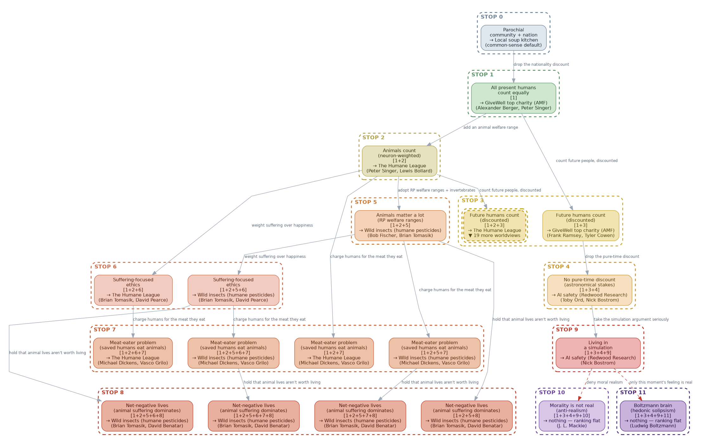

# Train to Crazy Town

How far down the effective-altruism reasoning train should you ride — and what
should you donate to at each stop?

This repo answers that with a **worldview explorer**: a zoomable tree of
"get-off points" where every node is a worldview, every worldview ranks the
same nine donation targets by expected value, and the winner changes as you
accept one more assumption. Click any node and its full cost-effectiveness
model opens in a live, editable [Squiggle](https://www.squiggle-language.com)
playground — no account needed — so you can change any number and watch the
ranking re-rank.

[](https://viewer.diagrams.net/?lightbox=1&nav=1&chrome=0#Uhttps%3A%2F%2Fraw.githubusercontent.com%2Fmorganrivers%2Ftrain_to_crazy_town%2Fmain%2Fdiagram%2Ftrain_tree.drawio)

**[Open the interactive diagram](https://viewer.diagrams.net/?lightbox=1&nav=1&chrome=0#Uhttps%3A%2F%2Fraw.githubusercontent.com%2Fmorganrivers%2Ftrain_to_crazy_town%2Fmain%2Fdiagram%2Ftrain_tree.drawio)**
(read-only draw.io viewer, no account, pan/zoom; hover a node for its story,
click it for its live model — draw.io serves the committed `train_tree.drawio`
straight from its raw GitHub URL). Also available as
[PNG](https://raw.githubusercontent.com/morganrivers/train_to_crazy_town/main/diagram/train_tree.png)
/ [SVG](https://raw.githubusercontent.com/morganrivers/train_to_crazy_town/main/diagram/train_tree.svg)
(the SVG is clickable too).

## The metaphor

The "train to crazy town" is Ajeya Cotra's image (80,000 Hours podcast #90,
*worldview diversification*). EA-style reasoning is a train:

> "a train going to crazy town, and the near-termist side is like, I'm going to
> get off the train before we get to the point where all we're focusing on is
> existential risk because of the astronomical waste argument."
> — Ajeya Cotra

Each stop is a point where accepting one more individually-plausible premise
carries you to a more counterintuitive conclusion, and you are free to get off
at any stop. Near-termists get off early (measurable global health);
longtermists ride further. A later stop can retroactively reframe an earlier
one.

## How to read the tree

- **A node is a worldview** — a chain of numbered assumptions (the `[1+2+5]`
  tag), with the donation target that worldview ranks first and the public
  figures who most prominently articulate its latest assumption.
- **An edge accepts exactly one more assumption.**
- **A band (STOP 0–13) is how far down the line a worldview rides** — its
  craziest accepted assumption, coloured calm slate at the top to override
  violet at the bottom.
- **The decision rule never changes.** Every worldview maximizes expected
  welfare-adjusted DALYs averted per dollar (`wDALY/$` — a DALY scaled by a
  species' welfare range, so one unit covers human health, animals, and future
  minds). Only the assumptions change; the same optimizer returns different
  winners.
- **Every genuinely uncertain number is a distribution.** Direct effects are
  lognormal 90% CIs; uncertain moral parameters (the pure-time discount, the
  simulation-continuation probability, the suffering asymmetry, …) are named,
  cited distributions in each model's prelude. Rankings sort on exact analytic
  means, so the Python side and the Squiggle models agree to float precision —
  and editing any distribution in the playground re-ranks the slate live.
- **The tree is too big for one screen, so it's split into pages.** A branch
  large enough to deserve its own page is collapsed on its parent to a
  `▼ N more worldviews` node (dashed double border); click it to open that
  subtree's own page. The image above is the top page — the rest are one click
  in.

## The assumptions (ordered by how crazy they are)

The root worldview is parochial: only my family and local community count, and
a soup kitchen wins. Each numbered assumption modifies the worldview before it:

1. **far-away humans count** — distance is not morally relevant → global health
2. **animals count, somewhat** — neuron-weighted welfare → corporate campaigns
3. **future humans matter, discounted** — a positive pure-time rate annihilates
   the astronomical far future → global health still holds
4. **no discounting the future** — astronomical stakes → AI safety (which edges
   out ALLFED on the slate's worked BOTECs — a close, contestable race)
5. **animals matter a lot** — Rethink Priorities welfare ranges, invertebrates →
   shrimp welfare (this worldview reproduces Grilo's published numbers)
6. **suffering-focused ethics** — averting suffering beats creating happiness
7. **the meat-eater problem** — a saved human eats animals for a lifetime, so
   human charities are charged for the factory farming they cause (Grilo)
8. **net-negative animal lives** — farmed and wild lives aren't worth living;
   with the meat-eater problem, human charities come out net-harmful
9. **living in a simulation** — the far future only counts if it keeps running
10. **person-affecting view** — making happy people is neutral, so the
    astronomical case for x-risk collapses (Narveson)
11. **count soil animals** — ~10^19 soil nematodes/mites; global health expands
    cropland and, on Grilo's figure, comes out net-harmful
12. **morality is not real** — every value goes to 0; keep your money
13. **Boltzmann brain** — only this moment's feeling is real; nothing to choose

Two things are deliberately *not* assumptions, because a worldview should change
what you *believe*, not force a result: **whether resilient foods beat AI
safety** is decided by the two orgs' worked BOTECs (change an input and the
ranking moves — Denkenberger & Pearce vs Linch), and **whether RP's invertebrate
welfare ranges are inflated** (the two-envelope critique) is a methodological
correction documented as a judgment call in the code, not a fork.

Not every combination is a coherent person — an animals person won't think only
their own community matters, and the near-term meat-eater bookkeeping is moot
once astronomical stakes dominate — so compatibility rules prune 8,192 possible
chains to **73 worldviews**. The ladder, the rules, and how chains compose are
documented in [`assumptions/README.md`](assumptions/README.md).

## What's in the repo

- **[`assumptions/`](assumptions/README.md)** — the single source of truth:
  fourteen numbered Python assumption files that compose into the 73 worldviews.
- **[`squiggle/`](squiggle/README.md)** — one standalone Squiggle model per
  worldview (generated), each exporting its ranking and `worldviewEv`, the
  expected value of that worldview. Runnable locally, in the playground links,
  or on Squiggle Hub.
- **[`diagram/`](diagram/README.md)** — the Graphviz → draw.io / PNG / SVG
  pipeline that draws the tree and wires every node to its playground link.
- **`allocate.py`** — a worldview-diversified donation allocator:

  ```bash
  python3 allocate.py --center w1_2_5 --diversification 2
  ```

  prints each org's expected cost-effectiveness (as a multiple of GiveWell top
  charities) and its share of a portfolio. `--center` is the worldview you lean
  toward (`--list` shows all 73); `--diversification 0` goes all-in on its
  single winner, higher values spread credence across nearby worldviews and
  fund the best org in each.
- **`generate.py` / `test_worldviews.py`** — regenerate every derived file from
  the assumptions and assert (in CI) that nothing has drifted.

## Sources

- Ajeya Cotra, *Worldview diversification and how big the future could be*,
  80,000 Hours Podcast #90 —
  https://80000hours.org/podcast/episodes/ajeya-cotra-worldview-diversification/
- Alexander Berger, *Improving global health and wellbeing in clear and direct
  ways*, 80,000 Hours Podcast —
  https://80000hours.org/podcast/episodes/alexander-berger-improving-global-health-wellbeing-clear-direct-ways/
- *When to get off the train to crazy town?* — EA Forum —
  https://forum.effectivealtruism.org/posts/feejxTPvBJY2cfXRp/when-to-get-off-the-train-to-crazy-town
- Rethink Priorities, *Welfare range estimates* (Fischer et al.) —
  https://rethinkpriorities.org/research-area/welfare-range-estimates/
- *The meat-eater problem* — EA Forum topic —
  https://forum.effectivealtruism.org/topics/meat-eater-problem
- Brian Tomasik, *The Importance of Wild-Animal Suffering* —
  https://reducing-suffering.org/the-importance-of-wild-animal-suffering/
- Vasco Grilo, *Cost-effectiveness of corporate campaigns for chicken welfare*
  (~1.67–14.3 DALY/$, ~168–1,440× GiveWell) — EA Forum —
  https://forum.effectivealtruism.org/posts/8FqWSqv9AeLowgajn/cost-effectiveness-of-corporate-campaigns-for-chicken
- Saulius Šimčikas, *Corporate campaigns affect 9 to 120 years of chicken life
  per dollar spent* — Rethink Priorities —
  https://rethinkpriorities.org/research-area/corporate-campaigns-affect-9-to-120-years-of-chicken-life-per-dollar-spent/
- Vasco Grilo, *Cost-effectiveness of the Shrimp Welfare Project's Humane
  Slaughter Initiative* (639 DALY/$, ~64k× GiveWell) — EA Forum —
  https://forum.effectivealtruism.org/posts/EbQysXxofbSqkbAiT/cost-effectiveness-of-shrimp-welfare-project-s-humane
- Vasco Grilo, *Cost-effectiveness of paying farmers to use more humane
  pesticides* (236 DALY/$, ~24k× GiveWell) — EA Forum —
  https://forum.effectivealtruism.org/posts/mgsiDB2Kkm3mDSWWP/cost-effectiveness-of-paying-farmers-to-use-more-humane
- Vasco Grilo, *GiveWell may have made 1 billion dollars of harmful grants...*
  (meat-eater / soil-animal accounting) — EA Forum —
  https://forum.effectivealtruism.org/posts/FqioYEr97eoCQMxhk/givewell-may-have-made-1-billion-dollars-of-harmful-grants
- Nuño Sempere, *A Bayesian Adjustment to Rethink Priorities' Welfare Range
  Estimates* —
  https://nunosempere.com/blog/2023/02/19/bayesian-adjustment-to-rethink-priorities-welfare-range-estimates/
- David Denkenberger & Joshua Pearce, *Long-term cost-effectiveness of resilient
  foods for global catastrophes compared to AGI safety* —
  https://www.sciencedirect.com/science/article/abs/pii/S2212420922000176
- Linch Zhang, *How many EA 2021 $s would you trade off against a 0.01% chance
  of existential catastrophe?* — EA Forum —
  https://forum.effectivealtruism.org/posts/cKPkimztzKoCkZ75r/how-many-ea-2021-usds-would-you-trade-off-against-a-0-01
- Nick Bostrom, *Astronomical Waste* — https://www.nickbostrom.com/astronomical/waste.html
- Nick Bostrom, *Are You Living in a Computer Simulation?* (Philosophical
  Quarterly, 2003) — https://www.simulation-argument.com/simulation.pdf
- Ajeya Cotra, *Forecasting transformative AI: the "biological anchors" method* —
  https://www.cold-takes.com/forecasting-transformative-ai-the-biological-anchors-method-in-a-nutshell/
- Frank Ramsey, *A Mathematical Theory of Saving* (Economic Journal, 1928) —
  the classic case that a pure time preference is ethically indefensible
- Nicholas Stern et al., *The Stern Review on the Economics of Climate Change*
  (2006, pure rate δ ≈ 0.1%/yr) vs William Nordhaus, *A Review of the Stern
  Review* (JEL, 2007, ~1.5%/yr) — the published disagreement behind the
  discount-rate distribution in assumption 3
- Toby Ord, *The Precipice* (2020) — the ~1/6-per-century existential-risk
  estimate behind the catastrophe-hazard component of the discount
- Hilary Greaves & William MacAskill, *The Case for Strong Longtermism* (GPI
  working paper) — and the person-affecting objection assumption 11 encodes
- David Thorstad, *Existential risk pessimism and the time of perils* — the
  skeptical low end of the AI-safety entry's CI —
  https://globalprioritiesinstitute.org/existential-risk-pessimism-and-the-time-of-perils-david-thorstad/
- Magnus Vinding, *Suffering-Focused Ethics: Defense and Implications* (2020) —
  https://centerforreducingsuffering.org/research/suffering-focused-ethics-defense-and-implications/
- David Benatar, *Better Never to Have Been* (2006) — the asymmetry behind
  net-negative lives
- Our World in Data, *How many animals are farmed?* (FAOSTAT) — the ~26-33
  billion live chickens anchoring the meat-eater ratio —
  https://ourworldindata.org/how-many-animals-are-farmed
- Welfare Footprint Project — pain-track estimates behind the
  suffering-per-farmed-life-year CI — https://welfarefootprint.org
- Open Philanthropy, *2017 Report on Consciousness and Moral Patienthood* —
  https://www.openphilanthropy.org/research/2017-report-on-consciousness-and-moral-patienthood/
- Rethink Priorities, *Why Neuron Counts Shouldn't Be Used as Proxies for
  Moral Weight* —
  https://rethinkpriorities.org/publications/why-neuron-counts-shouldnt-be-used-as-proxies-for-moral-weight
